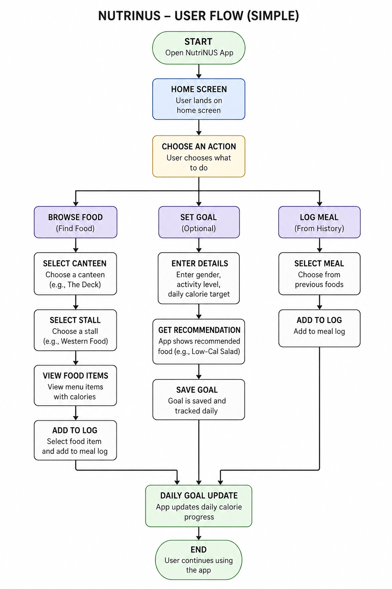
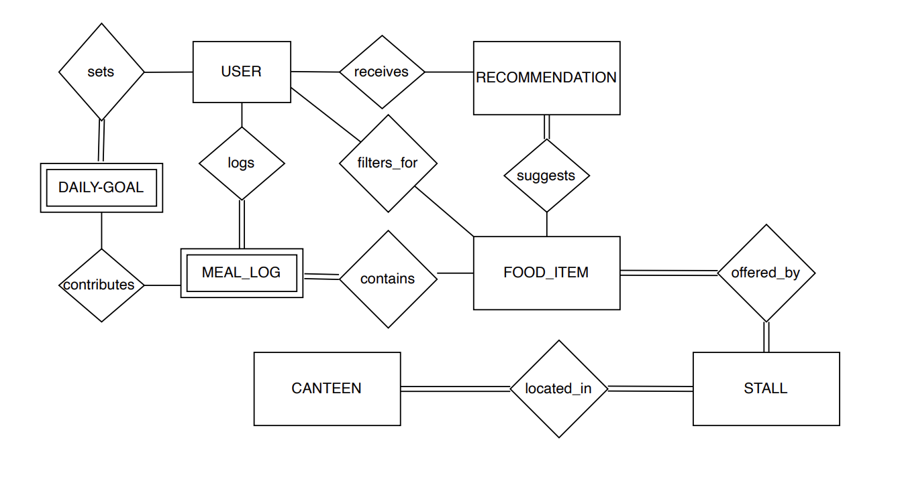

# **NutriNUS - 6986** 
Your NUS food companion for healthier choices!

## **TEAM** 

**Team Name:** NutriNUS 

**Members:** Liang Jiayang and Toh Yan Ru

**Level of Achievement:** Project Gemini 

---

## **Project Scope** 

NutriNUS is a user-friendly mobile application designed for NUS students to discover, log, and track their meals conveniently in school. By aggregating standardised nutritional data from canteens like Frontier, The Deck, Technoedge and Terrace into one place, NutriNUS empowers students to make consistent, health-conscious food decisions throughout their daily campus life.

## **Problem Motivation**

As students who are highly conscious of our food intakes and want to eat healthily on campus, we realised that NUS lacks resources to support health-conscious lifestyles. Nutritional information across campus canteens is inaccessible, inconsistent, and difficult to compare. This makes it challenging to make informed dietary decisions on the go. With the prevailing preference for oily and fried food on campus, we were motivated to build a practical solution that bridges this gap and helps students like us eat better on a daily basis. 

## **User Stories**

1. As a **health-conscious NUS student**, I want to access standardised nutritional information from NUS canteens so that I can make more informed dining decisions.
2. As a **student with specific fitness goals** (e.g. weight loss or muscle gain), I want to input my personal details so that the app can recommend food options that help me hit my daily nutritional targets.
3. As a **student managing my daily intake**, I want to log the food I consume so that I can monitor my daily caloric and macronutrient intake.
4. As a **busy student who prioritises convenience**, I want to quickly search for food by cuisine or dish so that I can easily find the healthiest option without spending too much time.
5. As a **student who struggles with consistency**, I want to earn points and complete health challenges so that I feel more motivated to maintain healthy habits.

---

## Proposed Core Features

### 1. Centralised Food & Nutrition Database
Aggregates standardised nutritional information (calories, protein, carbs, fats) from NUS canteens into one searchable platform. Users can browse dishes by stall or canteen using an integrated search bar.

**Implementation:** Nutritional data is manually extracted from publicly available NUS canteen PDF documents and stored in Firebase. The React Native frontend retrieves and displays this data, allowing users to browse and search by canteen or dish.

### 2. User Profiling & Personalised Targets
Users input personal details such as weight, height, activity level, and fitness goals. BMI and other calculations are used to compute personalised daily caloric and macronutrient targets to guide dietary decisions.

**Implementation:** User profile data is stored in Firebase under each authenticated user. Caloric and macronutrient target calculations are handled on the frontend using standard nutritional formulas.

### 3. Meal Logging & Intake Tracking
A daily tracking dashboard where users log meals and view remaining calories and macronutrients at a glance in a clear, summarised view.

**Implementation:** Each meal log entry is saved to Firebase under the user's profile, tagged by date. The dashboard retrieves the day's logs and computes remaining intake against the user's personalised targets in real time.

### 4. Food Recommendation System
Suggests suitable food options available within NUS based on the user's remaining nutritional needs and personal goals, surfaced through a filtered search interface.

**Implementation:** Recommendations are generated by querying the Firebase food database and filtering results against the user's remaining daily targets, sorted by nutritional fit.

### 5. Gamification & Health Challenges *(Extension)*
Users earn points by completing health challenges such as hitting step goals, caloric goals, and macronutrient targets. Points can be redeemed for discounts at partnering healthier-choice stalls.

**Implementation:** Challenge progress and point balances are stored and tracked in Firebase per user. Completion is triggered automatically when daily targets are met through meal logging.

---

## Design & Plan

NutriNUS follows the principle of **Separation of Concerns (SoC)** — each part of the system has clearly defined responsibilities with minimal overlap, keeping the codebase organised, modular, and scalable.

### Tech Stack

| Tool | Purpose |
|---|---|
| React Native | Frontend, app development |
| Firebase | Stores food database, user profiles, meal logs, and challenge progress |
| NUS Nutritional PDFs | Source of canteen food and nutritional data  |
| Figma | UI/UX design |
| GitHub | Version control |
| Postman | API testing |

### Software Architecture

NutriNUS is structured around three layers:

- **Frontend (React Native)** — all UI screens and user interactions
- **Backend Logic** — business logic such as BMI calculation, recommendation filtering, and gamification rules
- **Database (Firebase)** — stores user profiles, food items extracted from NUS PDFs, meal logs, and challenge data

### Product Flow (Activity Diagram) 

 

### ERM Diagram  

### Links to Poster and Video 
[Poster](https://canva.link/jfhimry49n45xsj)

[Video](https://youtu.be/ZmHYcffViCs)
